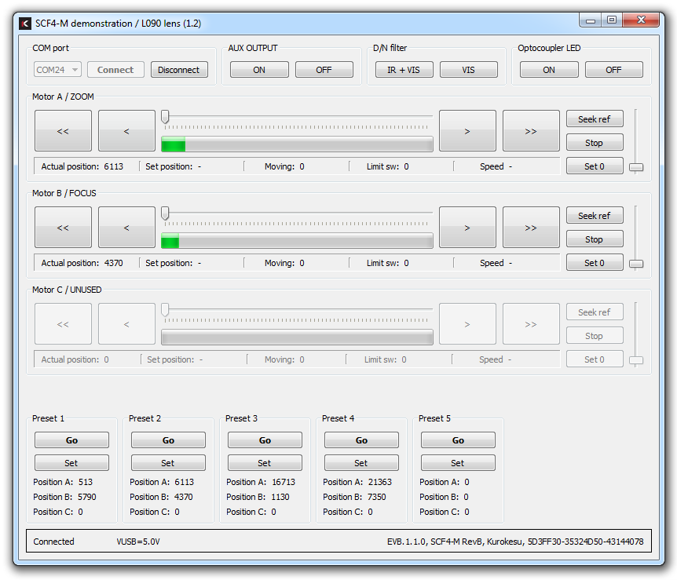

Kurokesu SCF4 multi-axis stepper motor controller System On Module (SOM) targets applications where time to market, reliability and small footprint is important. Main control MCU is ST Cortex STM32F103 powerful enough either to run standard or run dedicated standalone firmware. The motor front end is based on ON Semiconductor new and highly specialized chipset LC898201. 

**[Full documentation moved to WIKI](https://wiki.kurokesu.com/books/scf4)**

Some standalone use examples:

* React to lidar distance sensor and adjust focus/zoom accordingly
* Switch day/night filter by measuring ambient light intensity (with dedicated analog or digital sensor)
* Take R/C inputs and control Remote-controlled drone or vehicle lens
* Switch / reconfigure lens by single GPIO input (for example: reconfigure lens for wide/near operation by toggling GPIO pin)
* And much more...

Managed mode (default) target applications worth mentioning:

* Computer vision and analysis applications
* Scientiffic applications
* Neural network image processing and recognition applications
* Transport systems (ITS) 
* Universal Pan/Tilt/Zoom and/or Focus/Zoom/Iris/+ driver
* Toll systems
* Trafic or segmental speed measurement
* ROV/Drone lens control unit
* Face recognition applications
* Long term time-lapse cameras
* Distant camera installations that may require reconfiguring optical train remotely
* And much more...

More details and ordering info at [https://www.kurokesu.com](https://www.kurokesu.com)

