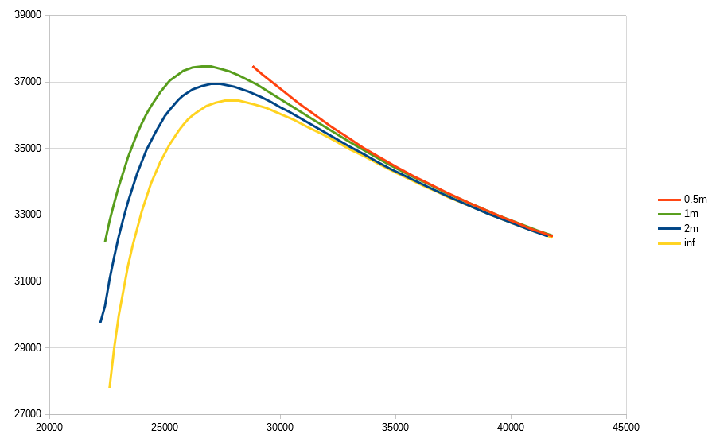
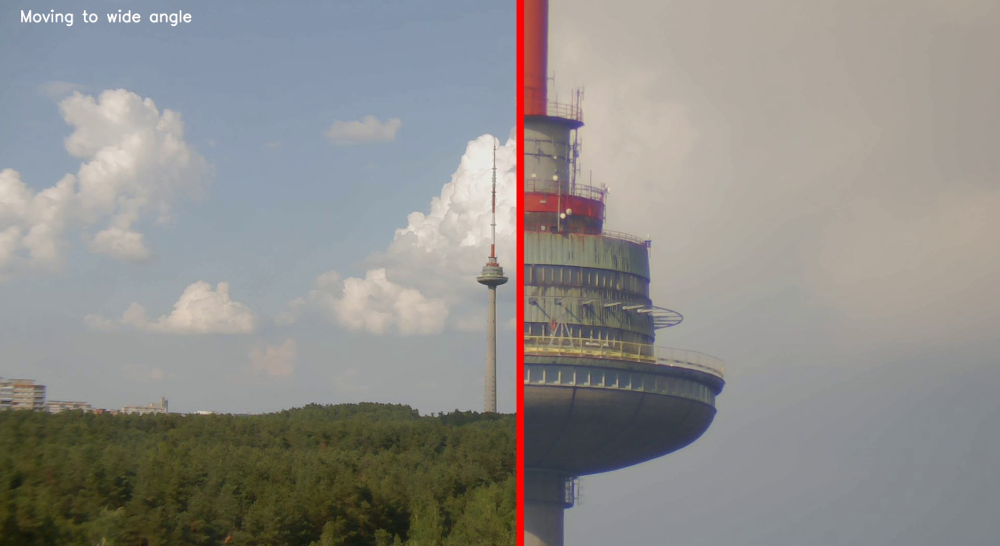

### Parfocal lens experiments

Measure a few calibration points by hand.

And run `sweep.py` code for smooth transition from wide to narrow view angle without loosing sharp focus.

More details on blog [https://www.kurokesu.com/main/2021/07/01/experiments-with-parfocal-motorized-zoom-lens/]
