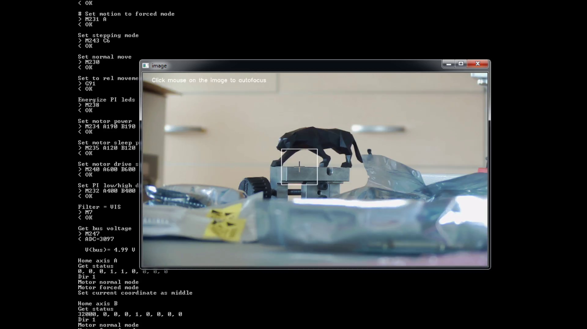

This is demonstration of motorized zoom lens auto-focus functionality with Python and OpenCV. Focus sweep is made slower and full range scan is made on purpose - this is starting point/framework for implementing smarter focus algorithms.

https://www.youtube.com/watch?v=GwongGmxo7E

